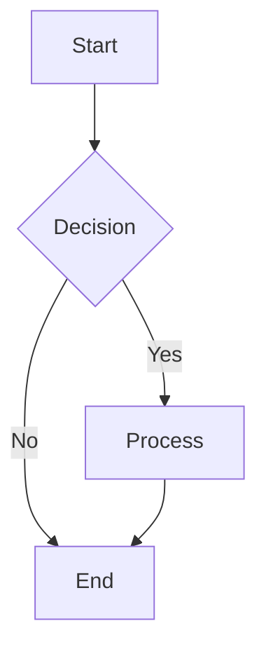

test_image# Chaos Edge Cases

This document contains deliberately problematic markdown constructs designed to test parser robustness.

## Relative Image Reference


## Mermaid Diagram Support



## Raw HTML Embedding

<div style="color: red;">Warning</div>

## Broken Table (Intentional Syntax Error)

| Header A | Header B | Header C |
|----------|----------|----------|
| Col 1    | Col 2    | Col 3    |
| Cell A   | Cell B   | Cell C   | Cell D | Cell E |

## Deeply Nested List

- Level 1
  - Level 2
    - Level 3
      - Level 4
        - Level 5
          - Level 6
            - Level 7 (going deeper)

## Long Line of Minified JSON

```json
{"id":"usr_8f7a6b5c4d3e2f1a9b0c8d7e6f5a4b3c2d1e0f9a8b7c6d5e4f3a2b1c0d9e8f7a6b5c4d3e2f1a","username":"ultra_long_username_that_never_ends_but_keeps_going_for_testing_purposes_only","email":"this_is_a_very_long_email_address_that_exceeds_normal_length_requirements@example_domain_that_is_made_up_for_testing_123456789.com","created_at":"2024-01-01T00:00:00.000Z","data":{"nested":{"deep":{"structure":{"with":{"many":{"levels":{"of":{"object":{"nesting":{"that":{"goes":{"on":{"and":{"on":{"forever":{"until":{"the":{"line":{"becomes":{"ridiculously":{"long":{"for":{"testing":{"horizontal":{"scrolling":{"behavior":{"in":{"markdown":{"renderers":{"and":{"code":{"editors":{"without":{"any":{"line":{"breaks":{"whatsoever":{"so":{"it":{"just":{"keeps":{"going":{"until":{"we":{"reach":{"the":{"end":{"of":{"this":{"string":{"literal":{"ending":{"here":null}}}}}}}}}}}}}}}}}}}}}}}}}}}}}}}}}}}}}}}}}}}}}}}}}}}}}}}}}}}}}}}}}}}}}}}}}}}}}}
```
